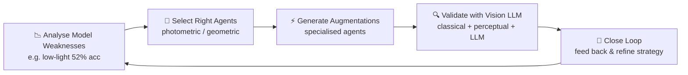

<div align="center">

# 🧠✨ Enhancement MultiAgent

### *Everyone's augmenting data. Almost no one's asking if it's actually **good** data.* 🤔

**Smart Data Augmentation with Multi-Agent Orchestration + Vision LLM Quality Gates**

[](https://python.org)
[](https://github.com/modelcontextprotocol)
[](https://ollama.com)
[](https://opencv.org)
[](LICENSE)
[](pyproject.toml)

[🚀 Quick Start](#-quick-start) • [🏗️ Architecture](#️-architecture) • [🤖 Agents](#-agents--modular-by-design) • [🔍 Quality Gates](#-quality-gates--extensible) • [📊 Benchmark](#-benchmark--reporting) • [🔌 Integrations](#-integrations--native-hooks) • [📚 Docs](docs/ARCHITECTURE.md)

---

**🔗 Repo:** `youssefmohana/EnhancmentMultiAgent` &nbsp;|&nbsp; 💬 *Let's connect if you build with LangGraph / AutoGen / CrewAI / Data-centric AI*

</div>

---

## 💭 The Problem — Flip. Rotate. Blur. Ship it.

> That's the **standard playbook**. But your model doesn't need **more** images — it needs **smarter** images that fix what it's actually *bad* at.

**That's exactly what I'm building.** A **self-improving augmentation system** that gets smarter every training cycle — not just changing pixels, but teaching the system to *see* whether an augmentation actually makes sense.

---

## 🧩 What's Live Right Now — `v0.2.0`

| Feature | Icon | Status | Path |
|---------|------|--------|------|
| **Multi-Agent Orchestration** | 🎛️ | ✅ Live | `src/enhancement_multiagent/agents/` |
| Specialised agents working together, each handling a specific enhancement task — no more monolithic scripts | | | `agents/orchestrator.py` |
| **Modular by Design** | 🧱 | ✅ Live | `src/enhancement_multiagent/agents/base.py` |
| Plug in new agents (geometric, photometric, generative) without touching the core system | | | `register_agent()` |
| **Extensible Quality Gates** | 🔍 | ✅ Live | `src/enhancement_multiagent/quality/` |
| Swap between classical metrics, learned perceptual metrics, or Vision LLM reasoning | | | `QualityOrchestrator` |
| **Vision LLM Integration** | 👁️ | 🚀 In Progress | `src/enhancement_multiagent/quality/vision_llm.py` |
| Teaching the system to *see* whether an augmented image actually makes sense — central quality oracle via Ollama (`llava` / `llama3.2-vision`) | | | `VisionLLMOracle` |

---

## 🚀 The Future: A Data Augmentation Planner

### *The next evolution isn't just enhancing data. It's **planning** the enhancement.*



1. 🔎 **Analyse** your model's weaknesses (e.g., poor performance on low-light images)
2. 🎯 **Select** the right agents to target those specific gaps
3. ⚡ **Generate** the augmentations
4. ✅ **Validate** them with Vision LLM quality checks
5. 🔄 **Close the loop** — feed results back and refine the strategy

> **A self-improving augmentation system that gets smarter with every training cycle.**

### 📋 Roadmap

| Item | Icon | Status |
|------|------|--------|
| 🔄 Model-aware strategy selection | `planner/augmentation_planner.py` | ✅ Live |
| 📊 Built-in benchmarking & reporting | `benchmarking/` | ✅ Live |
| 🔌 Native hooks for **PyTorch**, **TensorFlow** & **Hugging Face** — make integrator like huggingface and tensorflow under dev 🚧 | `integrations/` | ✅ PyTorch · 🚧 HF/TF dev |
| 🧠 Vision LLM as the central quality oracle | `quality/vision_llm.py` | 🚀 In Progress |
| 🧪 **Albumentations Integration** | `integrations/albumentations.py` | 🔮 Future Work |

> **Note:** PyTorch is stable (`pip install -e ".[torch]"`). Hugging Face (`datasets`) and TensorFlow are under **dev** — `pip install -e ".[dev]"` or `uv sync --extra dev`. See [docs/INTEGRATIONS.md](docs/INTEGRATIONS.md).

#### 🔮 Future Work — Integrate with Albumentations

> **Next up: bridge our smart planner with the industry-standard Albumentations ecosystem.**

- **🔗 Albumentations Bridge** — `src/enhancement_multiagent/integrations/albumentations.py` (planned): auto-convert our `Agent` plans (`geometric`/`photometric`/`generative`) into `albumentations.Compose` pipelines, so you can keep using `A.HorizontalFlip`, `A.RandomBrightnessContrast`, `A.OpticalDistortion` with our model-aware selection & Vision LLM gates on top
- **🎯 Smart Compose** — instead of random transforms, `AugmentationPlanner` will generate an *Albumentations Compose* tailored to your model's weaknesses (e.g., low-light → `A.RandomGamma` + `A.CLAHE`), validated by our `QualityOrchestrator` before training
- **⚡ Zero-Friction Drop-In** — `AlbumentationsAugmenter(plan).get_compose()` → plug directly into PyTorch `Dataset` / Hugging Face `Dataset.map` without rewriting existing `A.Compose` code
- **📊 Benchmark Parity** — compare our agents vs Albumentations ops under same PSNR/SSIM/diversity + Vision LLM realism metrics in `benchmarking/`
- **Install (future):** `pip install -e ".[albumentations]"` or `uv sync --extra albumentations` → brings `albumentations>=1.4` + `augmentations` extras

```python
# 🔮 Future API (planned) — Albumentations + Smart Planner
from enhancement_multiagent.planner.augmentation_planner import AugmentationPlanner
from enhancement_multiagent.integrations.albumentations import AlbumentationsAugmenter  # future

planner = AugmentationPlanner()
plan = planner.plan_from_hint("low_light")  # model-aware

# Convert our plan → Albumentations Compose with quality gate
augmenter = AlbumentationsAugmenter(plan, quality_mode="vision")
compose = augmenter.get_compose()  # albumentations.Compose
augmented = compose(image=image)["image"]  # drop-in

# Or wrap existing Compose for validation
# augmenter.validate_with_vision_llm("orig.jpg", "aug.jpg")
```

> **Status:** 🔮 *Future Work* — not yet in `main`, tracking in `docs/INTEGRATIONS.md` roadmap. Want to co-build? Open an issue / DM — looking for Albumentations power users!

---

## 🏗️ Architecture

```
User Image / Dataset
        │
        ▼
┌─────────────────────────────┐
│  🧰 MCP Image Tool Server   │  OpenCV · FastMCP · stdio
│  • analyze_image_quality    │  12+ tools (denoise, upscale,
│  • flip / rotate / blur     │   flip, color_jitter, occlusion…)
│  • validate_augmentation    │
│  • plan_augmentation        │
└──────────────┬──────────────┘
               │ MCP protocol
               ▼
┌─────────────────────────────┐
│ 🎛️ Multi-Agent Orchestrator │
│  ├─ 🟦 Geometric Agent      │  flip, rotate, scale, affine
│  ├─ 🟨 Photometric Agent    │  brightness, contrast, noise
│  └─ 🟩 Generative Agent     │  upscale, inpaint, occlusion
└──────────────┬──────────────┘
               │
               ▼
┌─────────────────────────────┐
│ 🧠 Augmentation Planner     │
│  1. Weakness Analyzer       │  per-class acc / dataset gaps
│  2. Strategy Library        │  maps weakness → agent plan
│  3. Feedback Loop           │  refine via quality results
└──────────────┬──────────────┘
               │
               ▼
┌─────────────────────────────┐
│ 🔍 Quality Orchestrator     │  Extensible · swappable
│  • Classical (PSNR/SSIM)    │  fast, deterministic
│  • Perceptual (Edge/Hist)   │  LPIPS proxy
│  • Vision LLM Oracle        │  Ollama llava / fallback
└──────────────┬──────────────┘
               │
               ▼
┌─────────────────────────────┐
│ 📊 Benchmarking + 📦 Hooks  │
│  • PyTorch / TF (dev) / HF (dev) │
│  • Reports: markdown, csv, png   │
└─────────────────────────────┘
```

📚 **Deep dive:** [docs/ARCHITECTURE.md](docs/ARCHITECTURE.md) · [docs/AGENTS.md](docs/AGENTS.md) · [docs/QUALITY_GATES.md](docs/QUALITY_GATES.md)

---

## 📁 Project Structure — Senior Edition

```bash
Enhancement_MultiAgent/
├── 📄 README.md • pyproject.toml • uv.lock • requirements.txt • run.sh
├── ⚙️ configs/default.yaml          # pipeline & quality thresholds
├── 📚 docs/                          # ARCHITECTURE, AGENTS, QUALITY_GATES, INTEGRATIONS
├── 🖼️ assets/diagrams/               # architecture visuals (git-ignored outputs elsewhere)
├── 🧠 src/enhancement_multiagent/
│   ├── 🤖 agents/          # base, geometric, photometric, generative, orchestrator
│   ├── 🔍 quality/         # base, classical, perceptual, vision_llm (oracle)
│   ├── 🧩 planner/         # weakness_analyzer, augmentation_planner, feedback_loop
│   ├── 🔌 integrations/    # pytorch (stable) · huggingface/tensorflow (dev)
│   ├── 📊 benchmarking/    # metrics, reporter (psnr/ssim/diversity)
│   ├── 🔧 mcp/server.py    # FastMCP tool server (12 tools)
│   └── 🚀 pipelines/       # augmentation.py · restoration.py
├── 🔨 scripts/             # benchmark.py · batch_restore.py · download_benchmark.py
├── 💡 examples/            # augmentation_demo, pytorch_example, huggingface_example
├── ✅ tests/               # test_agents, test_planner, test_quality
└── 🚫 restored/ reports/ benchmark/ demo_images/ tmp/  # git-ignored generated
# Legacy shims at root (image_restoration.py, mcp_image_server.py, etc.) → re-export for backward compat
```

---

## ⚡ Quick Start

### 1️⃣ Install

```bash
# Ollama (for Vision LLM — optional, heuristic fallback works offline)
curl -fsSL https://ollama.com/install.sh | sh
ollama pull llama3.2
ollama pull llava   # vision oracle (optional)

# Python env
pip install -e .                    # core
pip install -e ".[dev]"             # + huggingface & tensorflow (dev)
# or
uv sync                  # core
uv sync --extra dev      # with dev integrators
```

### 2️⃣ Run

```bash
# 🧪 Demo (synthetic degraded image)
./run.sh demo
# or
python -m enhancement_multiagent.pipelines.restoration

# 🖼️ Restore single image
./run.sh restore my_photo.jpg
python -m enhancement_multiagent.pipelines.restoration my_photo.jpg

# 🧠 Smart Augmentation (model-aware)
./run.sh augment my_photo.jpg low_light
./run.sh augment my_photo.jpg blur
python -m enhancement_multiagent.pipelines.augmentation my_photo.jpg --weakness low_light --quality all
python -m enhancement_multiagent.pipelines.augmentation dataset/img.jpg --model-report report.json --max-augmentations 4

# 📊 Full benchmark
./run.sh benchmark

# 📁 Batch
./run.sh batch ./my_photos/

# 🔌 MCP server
./run.sh mcp
# enhance-augment / enhance-restore via console scripts (after pip install -e .)
enhance-augment my.jpg --weakness occlusion
```

---

## 🤖 Agents — Modular by Design

| Agent | File | Ops | Use Case |
|-------|------|-----|----------|
| 🟦 **Geometric** | `agents/geometric.py` | `flip`, `rotate`, `scale`, `crop`, `affine`, `perspective` | rotation/scale invariance |
| 🟨 **Photometric** | `agents/photometric.py` | `brightness`🔆, `contrast`, `color_jitter`, `blur`, `noise`, `clahe` | low-light, color cast |
| 🟩 **Generative** | `agents/generative.py` | `upscale`, `inpaint`, `synthetic_occlusion`, `cutmix`, `elastic` | occlusion, SR |

**Plug-in without core changes:**
```python
from enhancement_multiagent.agents.base import BaseAgent, AgentResult
from enhancement_multiagent.agents.orchestrator import MultiAgentOrchestrator

class MyAgent(BaseAgent):
    def __init__(self): super().__init__("my_agent", "does X")
    def augment(self, input_path, output_path, operation="my_op", **kw) -> AgentResult: ...
    def get_available_operations(self): return [{"op":"my_op"}]

orch = MultiAgentOrchestrator()
orch.register_agent("my", MyAgent())
orch.execute("in.png", "out.png", "my", "my_op")
```

---

## 🔍 Quality Gates — Extensible

| Gate | Metrics | Speed | Needs Ollama |
|------|---------|-------|--------------|
| **Classical** | PSNR, SSIM, MSE, blur, brightness | ⚡ Fast | ❌ |
| **Perceptual** | Edge IoU, hist correlation, LPIPS proxy | ⚡ Fast | ❌ |
| 🧠 **Vision LLM** | `semantic_valid`, `realism_score`, `artifact_severity`, `keep` | 🐢 LLM | ✅ (fallback → heuristic) |

```python
from enhancement_multiagent.quality.vision_llm import QualityOrchestrator
q = QualityOrchestrator()  # all gates
res = q.validate("orig.png", "aug.png", mode="all")  # or "classical" / "vision" / ["classical","vision"]
# {"final_pass": True, "avg_score": 0.72, "votes": "2/3", "gates": {...}}
```

---

## 🧩 Planner — Model-Aware

```python
from enhancement_multiagent.planner.augmentation_planner import AugmentationPlanner
planner = AugmentationPlanner()
# from model report
plan = planner.plan_from_model_report({"per_class_accuracy": {"low_light": 0.52, "normal": 0.9}})
# from dataset distribution gaps
plan = planner.plan_from_dataset("data/train", performance_json="report.json")
# direct hint
plan = planner.plan_from_hint("occlusion")
# → [{"agent":"photometric","operation":"brightness","params":{"gamma":0.5}}, ...]
```

Feedback loop auto-refines: `planner/adaptive_plan()` + `FeedbackLoop` logs to `reports/feedback_log.json`.

---

## 📊 Benchmark & Reporting

Built-in metrics: **PSNR / SSIM / MSE / MAE / edge diff / diversity (1 - hist corr)** + Vision LLM validation.

```bash
python scripts/download_benchmark.py  # 10 synthetic or classic images (lena, barbara…)
python scripts/benchmark.py           # → reports/benchmark_report.md + csv + png
```

Outputs: `reports/benchmark_report_{timestamp}.md`, `benchmark_results_{timestamp}.csv`, `benchmark_chart_{timestamp}.png`

---

## 🔌 Integrations — Native Hooks

| Framework | Status | Path | Install |
|-----------|--------|------|---------|
| **PyTorch** | ✅ Stable | `integrations/pytorch.py` | `pip install -e ".[torch]"` |
| **Hugging Face** | 🚧 Dev | `integrations/huggingface.py` | `pip install -e ".[dev]"` |
| **TensorFlow** | 🚧 Dev | `integrations/tensorflow.py` | `pip install -e ".[dev]"` |

> make integrator like huggingface and tensorflow under dev — they live under `dev` extra and are experimental. PyTorch is production-ready.

```python
# PyTorch
from enhancement_multiagent.integrations.pytorch import SmartAugmentationDataset
smart_ds = SmartAugmentationDataset(base_dataset, plan, quality_mode="all", apply_prob=0.7)

# Hugging Face (dev)
from enhancement_multiagent.integrations.huggingface import HFDatasetAugmenter
ds_aug = HFDatasetAugmenter(plan).augment_dataset(dataset)

# TensorFlow (dev)
from enhancement_multiagent.integrations.tensorflow import get_tf_augmentation_layer
layer = get_tf_augmentation_layer(plan)
```

---

## 🤝 Let's Connect

I'm actively building this and love to talk to folks in:

- 🤖 Multi-agent systems (LangGraph, AutoGen, CrewAI)
- 📈 Data-centric AI & Generative CV
- 🔍 Quality assessment & Vision LLM

**Drop a comment or DM!** 💬

---

<div align="center">

### 🌟 Star if you believe in **smarter**, not just **more**, data!

**#AI #MachineLearning #DeepLearning #ComputerVision #MultiAgent #DataAugmentation #LLM #OpenSource #DataScience #GenerativeAI**

*MIT License — built with ❤️ by [@youssefmohana](https://github.com/youssefmohana) — Ollama + FastMCP + OpenCV*

</div>
